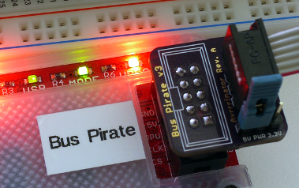

# avrrrinator

These are the Eagle source files for the Avrrrinator, a Bus Pirate 3 to AVR ISP adapter. 

### Which should I choose?

#### [Avrrrinator Rev. A](hardware/revA)

https://github.com/davidk/avrrrinator/raw/master/hardware/revA/images/avrrinator-a2-bp.png

Straight Bus Pirate to AVR breakout with 5v/3.3v selection. No logic level
translation. Simple and works.

#### Avrrrinator Rev. B

To be announced (ETA: when Half Life 3 is released).
